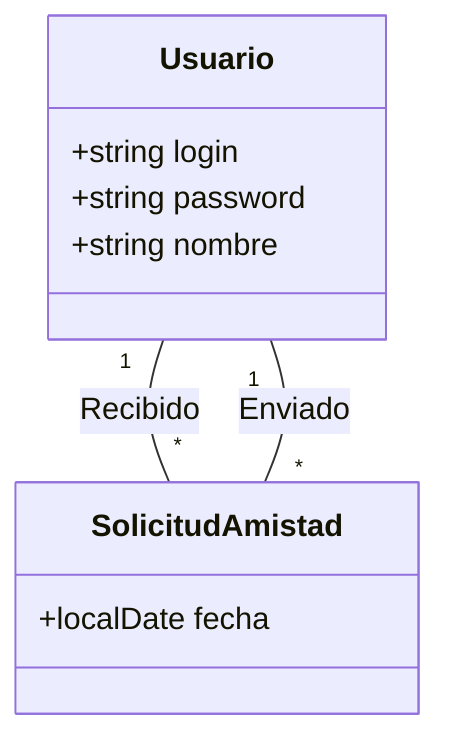

# Modelo de Clases

```mermaid
classDiagram

class Usuario{
    +string login
    +string password
    +string nombre
}

class SolicitudAmistad{
    +localDate fecha
}

Usuario "1"-- "*" SolicitudAmistad :Recibido  
Usuario "1" -- "*" SolicitudAmistad :Enviado
```